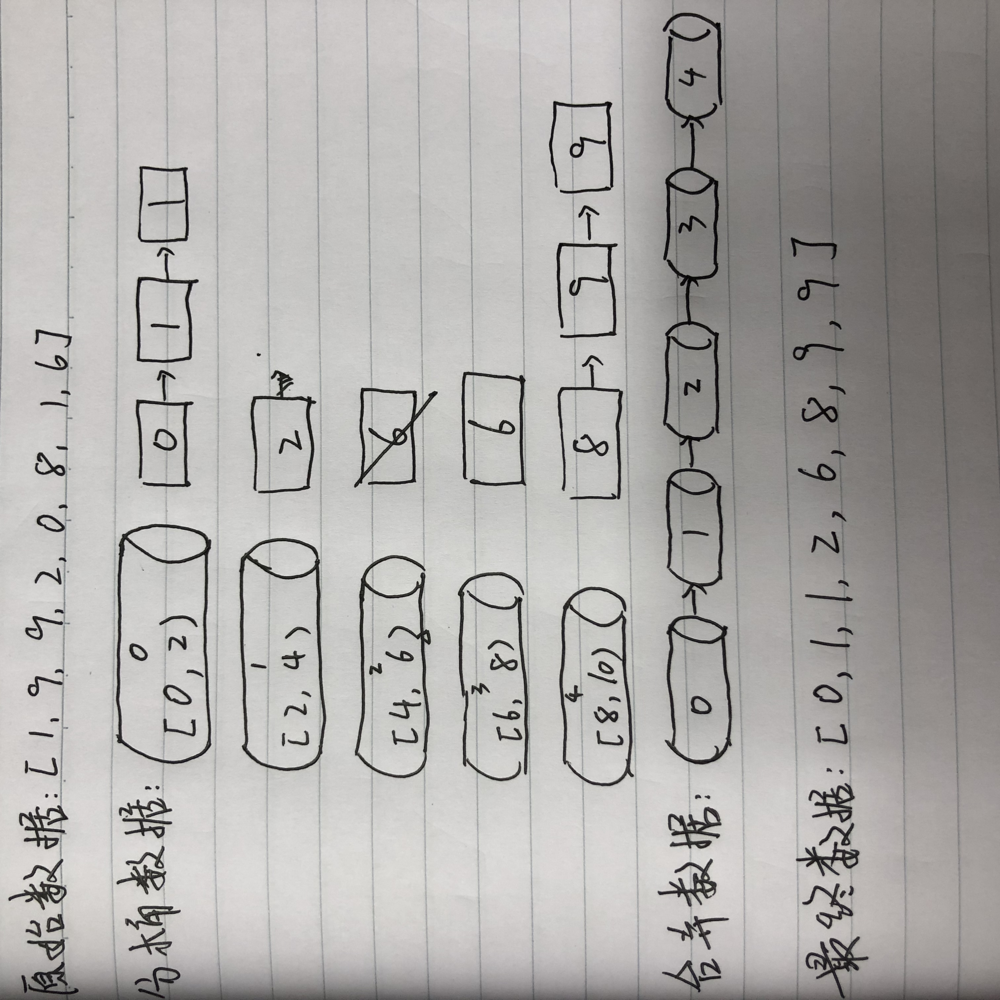

# 桶排序

## （一）思路:

### 1.设置固定空桶数

### 2.将数据放到对应的空桶中

### 3.将每个不为空的桶进行排序

### 4.拼接不为空的桶中的数据，得到结果

## （二）步骤演示:

### 假设一组数据(长度8)为 : [1, 9, 9, 2, 0, 8, 1, 6] ,现在需要按5个分桶，进行桶排序，实现步骤如下:

#### 1.找到数组中的最大值9和最小值0，然后根据桶数为5，计算出每个桶中的数据范围为(9 - 0 + 1)/5=2
 
#### 2.遍历原始数据，(以第一个数据1为例)先找到该数据对应的桶序列Math.floor((1 - 0) / 2) = 0，然后将该数据放入序列为0的桶中(从0开始算)

#### 3.当向同一个序列的桶中第二次插入数据时，判断桶中已存在的数字与新插入的数字的大小，按从左到右，从小打大的顺序插入。如第一个桶已经有了63，再插入51，67后，桶中的排序为(51,63,67) 一般通过链表来存放桶中数据，但js中可以使用数组来模拟

#### 4.全部数据装桶完毕后，按序列，从小到大合并所有非空的桶(如0,1,3,4桶)

#### 5.合并完之后就是已经排完序的数据

## （三）图示:

